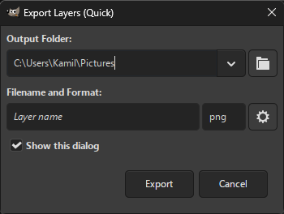

#  Batcher

Batcher is a batch image processing plug-in for [GIMP 3](https://www.gimp.org/).

## What can Batcher do?

* Convert image files to any file format provided by GIMP and third-party plug-ins
* Export layers as separate images from an image opened in GIMP 
* Export images opened in GIMP
* Batch-edit layers in an opened image
* Apply any filter or plug-in during batch processing (rename, scale, ...)
* Apply constraints to process only specific images/layers (matching a suffix, visible layers, ...)

## [Download latest release](https://github.com/kamilburda/batcher/releases/tag/1.0-RC4) (1.0-RC4, March 08, 2025)

## Installation and Usage

See the [webpage](https://kamilburda.github.io/batcher).

## Support

You can report issues or request new features on the [GitHub Issues page](https://github.com/kamilburda/batcher/issues).
Make sure to check the current issues first before submitting a report.

You can also ask questions or discuss ideas related to Batcher on the [GitHub Discussions page](https://github.com/kamilburda/batcher/discussions).

## Translations

To provide translations for Batcher, see [TRANSLATIONS](TRANSLATIONS.md) for instructions.
Thank you for your contribution. 😊

## Example screenshots

## License

Batcher is licensed under the [BSD 3-Clause](LICENSE) license.
