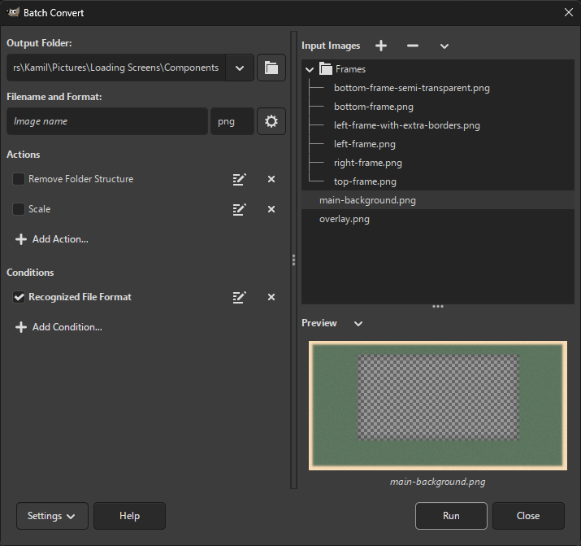

#  Batcher

Batcher is a batch image processing plug-in for [GIMP](https://www.gimp.org/).

**Batcher requires [GIMP 3.0.0-RC3](https://www.gimp.org/downloads/devel/) or later.**

## What can Batcher do?

* Convert image files to any file format provided by GIMP and third-party plug-ins
* Export layers as images
* Batch-edit layers in an image
* Apply any filter or plug-in during batch processing (rename, scale, ...)
* Apply constraints to process only specific images/layers (matching a suffix, visible layers, ...)

## [Download latest release](https://github.com/kamilburda/batcher/releases/tag/1.0-RC2) (1.0-RC2, February 10, 2025)

## Installation and Usage

See the [webpage](https://kamilburda.github.io/batcher).

## Support

You can report issues or request new features on the [GitHub Issues page](https://github.com/kamilburda/batcher/issues).
Make sure to check the current issues first before submitting a report.

You can also ask questions or discuss ideas related to Batcher on the [GitHub Discussions page](https://github.com/kamilburda/batcher/discussions).

## Example screenshot

## License

Batcher is licensed under the [BSD 3-Clause](LICENSE) license.
