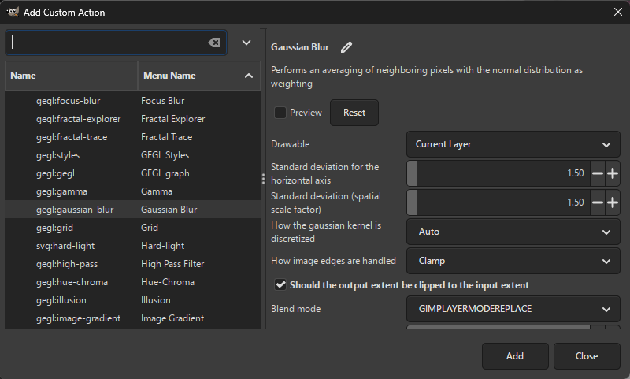

Actions allow you to apply image filters to each image/layer.
Press the `Add Action...` button and select one of the available actions, or add a [custom action](#adding-custom-actions).

For each action, you may:
* enable/disable the action,
* move the action up/down by dragging the action with mouse or by pressing Alt + Up/Down on your keyboard,
* [edit the action](Editing Actions and Conditions.md),
* remove the action.

You can add the same action multiple times.

## Built-in Actions

### File and Naming

#### Rename

Renames images/layers according to the specified pattern.

This action uses the same text entry as the one in Batch Convert or Export Layers next to `Filename`, described in [Renaming](Renaming.md).

Additionally, this action allows customizing whether to rename both images/layers and folders (by checking `Rename folders`/`Rename group layers`) or rename folders only (by checking `Rename folders`/`Rename group layers` and unchecking `Rename images`/`Rename layers`).

For Batch Convert and Export Layers, this action performs renaming on top of the entry next to `Filename`.

For Edit and Save Images, renaming will have no effect unless the images are saved via the `Save` action.

#### Remove file extension from imported images

*Only available for: Edit and Save Images*

Removes the file extension from images opened in GIMP that were imported from a non-native file format (i.e. not XCF). Native XCF files and new images are kept intact.

#### Remove Folder Structure

*Only available for: Batch Convert, Export Layers, Edit Layers*

Exports all images to the output folder on the same level, i.e. subfolders are not created.

Options:
* (Edit Layers only) *Consider visibility of parent folders*: If checked, a layer will become invisible if any of its parents are not visible (even if the layer itself is visible). Having this checked corresponds to how the layers are displayed in the image canvas.

#### Export/Also Export As...

Exports an image/layer to the specified file format.

For Batch Convert and Export Layers, this performs export to another file format.

You can add this action multiple times to export to multiple file formats at once.

Options:
* *Output folder*: Folder to export the output image(s) to.
* *File extension*: File extension of the output image(s).
* All options specified in [Export Options](Export Options.md).

The name of the Export action is automatically updated as you modify the file extension.

For Batch Convert and Export Layers, when this action is added, the values of the options are copied from the default export options.
For example, the output folder will be identical to the one currently selected in the main dialog.
This simplifies setting up export to multiple file formats without the hassle of manually adjusting the export options in all added actions.

When exporting each image separately (the default, which can be changed via the *Perform export* option), it usually makes sense to apply the Export action as the last one since actions after Export would have no effect on the current image/layer being processed.

#### Save

*Only available for: Edit and Save Images*

Saves the images in the native GIMP (XCF) file format.

If the image already exists, it is overwritten.

Images that were imported or created within GIMP are renamed in the GIMP title bar to contain the `.xcf` file extension. The images are marked as having no unsaved changes.

To export the image in another file format, use the "Export Images" menu.

Options:
* *Output folder*: Folder to save images to. By default, existing XCF images are saved to their original locations (the `Use original location (override)` option). You may instead specify a folder where all images will be saved, including new and non-XCF images.
* *Output folder for new and imported images*: Folder where new images or non-XCF images are saved as XCF images.

### Resize and Transform

#### Scale

Scales (resizes) the entire image or a layer.

Options:
* *Apply to (image or layer)*: Whether to scale the current image, current layer, or other objects (e.g. background/foreground).
* *New width*: The new width, specified using an absolute unit (pixels, inches, ...) or a percentage (of width of the current image, layer, ...).
* *New height*: The new height, specified using an absolute unit (pixels, inches, ...) or a percentage (of width of the current image, layer, ...).
* *Aspect ratio*: Affects how scaling is performed, either preserving or ignoring the aspect ratio.
  * *None (Stretch)*: The aspect ratio is ignored (i.e. the image/layer is stretched).
  * *Keep, adjust width*: The aspect ratio is preserved. You may adjust the width, while the height is calculated automatically.
  * *Keep, adjust height*: The aspect ratio is preserved. You may adjust the height, while the width is calculated automatically.
  * *Fit*: The aspect ratio is preserved. The image/layer will be scaled such that it fits *New width* or *New height*, whichever is smaller.
  * *Fit with padding*: The aspect ratio is preserved. The image/layer will be scaled such that it fits *New width* and *New height*, and any remaining empty space is filled with the specified padding color. You can customize where the padding is positioned relative to the image/layer (from the start, center, end or from a custom starting position).
* *Interpolation*: Type of interpolation to use.
* *Use local origin*: If checked and the object to scale is a layer, it will be scaled around its center. If not checked, the layer will be placed in the upper left corner of the image.
* *Set image resolution in DPI*: Whether to set a new resolution for the current image.
* *X* and *Y*: The new image resolution in DPI. Only applicable if *Set image resolution in DPI* is checked.

#### Resize Canvas

Resizes the image or layer extents, i.e. adds empty space from the edges. There are multiple ways you can perform resizing based on your needs. You may optionally fill the added space with a color.

Note that this action does not upscale/downscale the image/layer. For that purpose, use the `Scale` action.

Options:
* *How to resize*:
  * *Resize from edges (add borders)*: Adds the specified amount at each edge. The amount can be specified in a variety of units (pixels, percentages, inches, ...). You can also remove content by specifying negative values.
  * *Resize from position*: Resizes to the specified width and height from the specified position, e.g. starting from the upper left corner, from the center, etc.
  * *Resize to aspect ratio*: Resizes to the specified aspect ratio (width:height), e.g. to 4:3 or 16:9 or any ratio of your choice. You can customize where the resizing starts (from the start, center, end or from a custom starting position).
  * *Resize to area*: Resizes to the area specified by offsets, width and height.
  * *Resize to layer size*: Resizes the image/layer to fit the specified layer(s).
  * *Resize to image size*: Resizes the image/layer to fit the specified image.
* *Fill added space with color*: If checked the newly added space will be filled with the color specified by *Color for added space*.
* *Color for added space*: The color to fill the newly added space with. If the image is resized, the currently processed layer is resized as well and is filled with this color.

For Export Layers, the *Resize to layer size* option is enabled by default.
This means that the exported image will have the same dimensions as the layer to export.
To keep the image canvas intact (thus keeping the layer position within the image), uncheck this action.
Note that in that case the layers will be cut off if they are partially outside the image canvas.

#### Crop

Crops the specified image or layer. There are multiple ways you can perform cropping based on your needs.

Options:
* *How to crop*:
  * *Crop from edges*: Removes the specified amount from each edge. The amount can be specified in a variety of units (pixels, percentages, inches, ...).
  * *Crop from position*: Crops to the specified width and height from the specified position, e.g. starting from the upper left corner, from the center, etc.
  * *Crop to aspect ratio*: Crops to the specified aspect ratio (width:height), e.g. to 4:3 or 16:9 or any ratio of your choice. You can customize where the cropping starts (from the start, center, end or from a custom starting position).
  * *Crop to area*: Crops to the area bounded by the starting position (X, Y), width and height.
  * *Remove empty borders*: Automatically removes empty areas along the edges of the image/layer.

#### Align and Offset

Aligns layer(s) with the current image or another layer.
You may specify additional offsets after the alignment is applied.

Options:
* *Layers to align*: Layers to align. This can be a single layer (e.g. the current layer, background, foreground) or all layers inserted in the currently processed image.
* *Object to align layers with*: Whether to align with the entire image or another layer.
* *Horizontal alignment*: Left, center or right alignment, or *Keep* the horizontal position intact.
* *Vertical alignment*: Top, center or bottom alignment, or *Keep* the vertical position intact.
* *Additional X-offset*: Moves the layers horizontally by the specified amount, using an absolute unit (pixels, inches, ...) or a percentage (of width of the current image, layer, ...).
* *Additional Y-offset*: Moves the layers vertically by the specified amount, using an absolute unit (pixels, inches, ...) or a percentage (of width of the current image, layer, ...).

#### Flip Horizontally

Flips the current image or layer horizontally around its center.

#### Flip Vertically

Flips the current image or layer vertically around its center.

#### Rotate

Rotates the current image or layer.

Options:
* *Apply to (image or layer)*: Whether to rotate the current image, current layer, or other objects (e.g. background/foreground).
* *Angle*: Rotate by 90, 180 or 270 degrees, or use a *Custom* angle.
* *Custom angle*: Rotation angle in degrees or radians. Applies only if *Angle* is set to *Custom*. If the custom angle is used on the image rather than a layer, all layers within the image are rotated around the image's center.
* *How to handle boundaries*: How to handle the extents of layers after rotation - resize the layer, clip or crop. If rotation is applied to an image, all layers are handled the same way. Note that resized layers will not cause the image to grow; to achieve that, add the `Resize Canvas` action and use `Resize to layer size`.
* *Interpolation*: Interpolation for rotated layers. Has effect only if *Angle* is set to *Custom*.
* *Rotate around the center*: If checked, the layer is rotated around their center.
* *Horizontal position of center*: The X-coordinate of the point around which the layer is rotated. Applies only if *Rotate around the center* is unchecked.
* *Vertical position of center*: The Y-coordinate of the point around which the layer is rotated. Applies only if *Rotate around the center* is unchecked.

### Layers and Composition

#### Insert Background

Inserts a new layer behind the current layer.

For Batch Convert, specify an image file to be loaded as background.

For Export Layers and Edit Layers, mark layers in your opened image with a color tag.
The _blue_ color tag is used for background by default.
You may set a different color tag by adjusting the `Color tag` option.

This action is inserted at the first position.
This prevents potential confusion when other actions are applied that could affect the image/layer extents (e.g. `Resize to layer size` in Export Layers).
You can always move this action lower as needed.

You can apply subsequent actions on the background using `Layer Below (Background)` instead of `Current Layer` (if available).

The background is merged automatically at the end of processing as the `Merge Background` action is automatically added. See `Merge Background` below for more information.

For Export Layers and Edit Layers, the background layers are excluded from processing by default as the `Not Background` condition is automatically added and enabled.

#### Insert Foreground

Inserts a new layer in front of the current layer.

For Export Layers and Edit Layers, the _green_ color tag is used as foreground by default.

You can apply subsequent actions on the foreground using `Layer Above (Foreground)` instead of `Current Layer` (if available).

The `Merge Foreground` action is added automatically. For Export Layers and Edit Layers, the `Not Foreground` condition is added automatically.

For more information, see `Insert Background` above.

#### Merge Background

*Only available if `Insert Background` is added*

Merges already inserted background (via `Insert Background`, see above) into the current layer.

When exporting, the background is merged automatically.
However, if needed, you can reorder this action to perform the merge earlier and then apply actions on the current layer, now merged with the background.

For [Edit Layers](../Usage.md#editing-layers), this action ensures that you have a single merged layer rather than having the background as a separate layer.
If this is not what you desire, you may uncheck this action.

If there is no background layer inserted, this action has no effect.

Options:
* *Merge type*: Indicates how to perform the merge. The available merge types are the same as for [Merge Visible Layers](https://docs.gimp.org/en/gimp-image-merge-layers.html), under the section `Final, Merged Layer should be:`.

#### Merge Foreground

*Only available if `Insert Foreground` is added*

Merges already inserted foreground (via `Insert Foreground`, see above) with the current layer.

For more information, see `Merge Background` above.

#### Apply Group Layer Appearance

*Only available for: Export Layers, Edit Layers*

Applies attributes (filters, opacity, mode, ...) from all parent group layers to the current layer to match its appearance in GIMP.

You can switch off individual attributes to customize the appearance.

If *Merge groups with layer* is enabled, the groups are merged into the layer.
Otherwise, the current layer is turned into a group layer.
Subsequent actions may in that case fail if they attempt to perform operations not allowed on group layers, e.g. applying layer effects destructively.

#### Merge Filters

Merges all visible filters (layer effects) in the specified layer.

#### Merge Visible Layers

*Only available for: Batch Convert, Export Images, Edit and Save Images*

Merges all visible layers within the image into a single layer. Invisible layers are removed.

This is useful if the image contains multiple layers and you want to apply filters (layer effects) or other actions on the entire image.

### Color

#### Brightness-Contrast

Adjusts brightness and contrast.

For GIMP 3.2 and later, you can choose between two different filters responsible for adjusting brightness and contrast: `GEGL` (uses the `gegl:brightness-contrast` filter) and `GIMP` (uses the `gimp:brightness-contrast` filter).

#### Levels

Applies levels from a saved preset file. Both GIMP and Photoshop (.alv) file formats are supported.

You can save a GIMP preset file by choosing `Export Current Settings to File` in the Levels tool.

At the moment, Batcher only supports preset files saved in the linear mode. If you saved your preset in a different mode (e.g. non-linear, perceptual), the action will fail with a warning dialog.

#### Curves

Applies curves from a saved preset file. Both GIMP and Photoshop (.acv) file formats are supported.

You can save a GIMP preset file by choosing `Export Current Settings to File` in the Curves tool.

At the moment, Batcher only supports preset files saved in the linear mode. If you saved your preset in a different mode (e.g. non-linear, perceptual), the action will fail with a warning dialog.

#### White Balance

Equivalent to `Colors → Auto → White Balance` in GIMP.

### G'MIC Filter

*Only available if [G'MIC](https://gmic.eu/) is installed as a GIMP plug-in*

Applies a [G'MIC](https://gmic.eu/) filter non-interactively.

To apply a filter, select a filter in G'MIC and press Ctrl+C, or click the copy button. Then paste the text into the `Command` text field.

## Adding Custom Actions

You can add any GIMP plug-in, layer effect (filter, GEGL operation) or GIMP action by pressing `Add Action...` and then selecting `Add Custom Action...`. Both built-in and any third-party plug-ins and layer effects are supported.

{: .align-center}

You can preview how the selected action affects the resulting image (by pressing `Preview`) and adjust action options.

Once you are settled on the action, press `Add` to permanently add it to the list of actions.
You can [edit the action](Editing Actions and Conditions.md) anytime after adding it.

All layer effects (actions under the `Filters, Effects` category) have the following common parameters:
* *Blend mode* - blend mode for the effect (default, dodge, burn, hard light, ...).
* *Opacity* - the opacity of the effect.
* *Merge filter* - the effect will be applied destructively, i.e. will be merged into the layer.
* *Visible* (displayed under `More options`) - if unchecked, the effect will be added, but will not be applied.
* *Filter name* (displayed under `More options`) - a custom name for the effect. If empty, a default name is assigned by GIMP.
