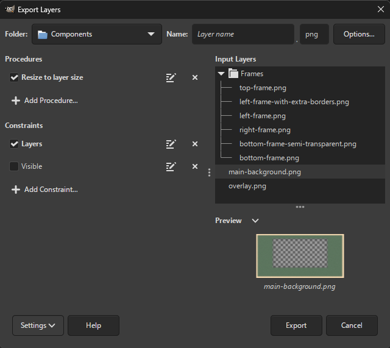
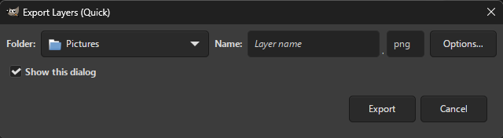
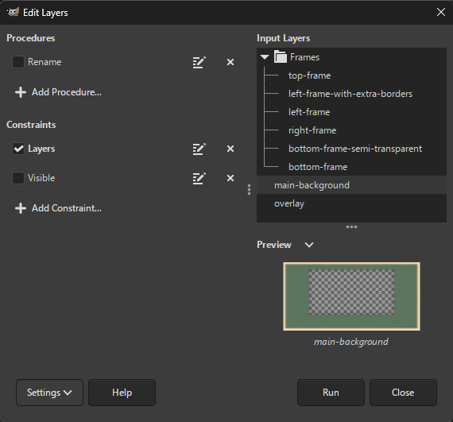

## Exporting Layers

Open your image in GIMP and select `File → Export Layers...`.

A dialog appears that allows you to adjust export settings, such as the output folder, filenames and the file extension.

To export layers, press the `Export` button.
If your chosen file format can be tweaked (e.g. compression level for PNG images), a dialog with file format settings will be displayed, allowing you to adjust them.

Below you will find more information on adjusting the export settings.

### Changing Filenames

By default, layer names are used as filenames.
The text entry next to `Save as` lets you customize the filenames.

For details, see [Adjusting Filenames](Customization.md#adjusting-layer-names-filenames).

### Changing File Extension

Type or choose your desired file extension next to the filename entry (`png` by default).

The dropdown list displays available file formats alongside their associated file extensions.
If a file format contains multiple file extensions, the first is selected by default, but you may also choose a different extension (by clicking on it or pressing Tab).

For now, the dropdown only contains a fixed list of file formats provided by GIMP and some recognized third-party plug-ins.
However, you can still enter a file extension not in the list in case you use an unrecognized file format plug-in.

### Procedures and Constraints

Before the export, you can apply a multitude of *procedures* to each layer, such as scaling or background insertion.

You can exclude layers from being exported based on one or more *constraints*, e.g. only visible layers or only layer groups.

Procedures and constraints can be a powerful way to adjust the export to your heart's content.
You can take a look at a few [examples](Customization.md#examples) to get started.

For details, see [Procedures](Customization.md#procedures) and [Constraints](Customization.md#constraints).

## Quick Export of Layers

If you need a simple export without customization, you can run `File → Export Layers (Quick)`.
This can also be useful if you made changes to your image and you want to export again with the same settings.

For the first time, a small dialog with only export settings is displayed, where you can adjust the basic export settings.

This dialog can be skipped by simply unchecking `Show this dialog`.

## Batch Editing Layers

Open your image in GIMP and select `File → Edit Layers...`.

This is where you leverage the power of [procedures](Customization.md#procedures) and [constraints](Customization.md#constraints).
The procedures will be applied to each layer in the current image satisfying the chosen constraints.
You can take a look at a few [examples](Customization.md#examples) to get started.

If the `Layers` constraint is unchecked, layer groups will also be processed. The layer groups will be copied and inserted as regular layers to work around the fact that some procedures cannot be applied on layer groups (e.g. `gimp-drawable-brightness-contrast`).

## Quick Batch Layer Editing

You can run batch editing in a single click by running `File → Edit Layers (Quick)`.
This can be useful if you made changes to your image and you want to run batch editing again with the same settings.

## Preview

The preview displays the resulting layer names and the contents the selected layer.

You can adjust the width of the entire preview by dragging the separator at the left edge of the preview.
You can also adjust the height of the previewed image by dragging the separator above the image.

If the previewed image takes too long to render, the preview is no longer updated automatically.
A refresh button above the image is displayed that allows you to manually update the image.
To switch between automatic and manual update, press the arrow button and select `Update Image Preview Automatically`.

Note that the preview is only an approximation of what the exported images will look like and thus is not completely accurate when exporting with certain file formats.
For example, the preview will show a transparent image if the JPEG format (which does not support transparency) is selected.

## Managing Settings

After a successful export or editing, your settings (output folder, file extension, dialog position and size, etc.) are automatically saved.
You can save settings manually anytime by selecting `Settings → Save Settings` or pressing Ctrl + S anywhere in the dialog.
To reset settings to their default values, select `Settings → Reset Settings`.

You may also save settings to a custom file by selecting `Settings → Save Settings to File...`.
This allows swapping between different plug-in configurations or sharing them.
To load settings from a file, select `Settings → Load Settings from File...` and select the file.

You can turn auto-closing the main dialog on/off by checking/unchecking `Settings → Close when Done`.

## Known Issues

Sometimes, after you press the Export button, it may seem as though nothing happens.
In that case, the file format dialog may be displayed behind GIMP. If so, simply select the dialog to bring it up.

The following file formats require displaying the file format dialog for each image to be exported, not just the first image:
* C source,
* HTML.

On Windows, exporting with the following file formats does not work properly if file paths contain accented (Unicode) characters:
* X PixMap Image.
