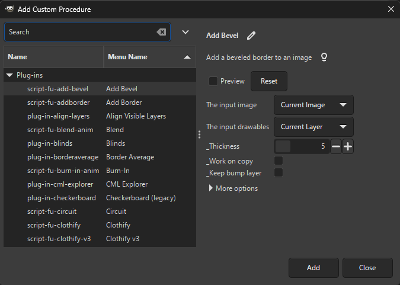

## Getting Started with Customization

Beyond the basic features, Batcher allows you to:
* adjust layer names,
* apply custom *procedures* to each layer (insert background, scale down, ...),
* filter layers by applying *constraints* (only visible layers, ...).

As the amount of customization may be overwhelming at first, you may want to take a look at a few [examples](#examples) below.

## Examples

**I want to export all layers using the image size, not the layer size.**

Uncheck or remove the `Use layer size` procedure.

**I want to export only visible layers.**

Check the `Visible` constraint (or add one if not already via `Add Constraint... → Visible`).

**I want to export only visible layers. However, I also want to exclude those that have invisible parent layer groups.**

1. Check the `Visible` constraint (or add one if not already).
2. Edit the `Visible` constraint (press the icon to the right of the constraint name).
   In the dialog, click on `More options` and then check `Also apply to parent folders`.

**I don't want to preserve folder hierarchy when exporting layers.**

Add the `Remove folder structure` procedure (`Add Procedure... → Remove folder structure`).

**How do I rename the layers to form a sequence of numbers, e.g. "image001", "image002", ...?**

Click on the text entry next to `Name` and choose `image001`, or type `image[001]` in the entry.

**My layers contain a '.'. All characters after the '.' are replaced with the file extension. How do I prevent this?**

In the text entry next to `Name`, choose `Full layer name` or type `[layer name, %e]`.
This ensures that the resulting image name will be e.g. `some.layer.png` instead of `some.png` (the default behavior).

**How do I export only layer groups at the top level?**

1. Uncheck the `Layers` constraint.
2. Add the `Layer groups` constraint.
3. Add the `Top-level` constraint.

**I want to adjust brightness in my layers. Can this be done?**

Yes! You may insert any GIMP filter as a procedure:
1. Select `Add Procedure... → Add Custom Procedure...`
2. Find `gimp-drawable-brightness-contrast` in the procedure browser.
3. Adjust the options as desired.
4. Select `Add` to add the procedure.

**I need every layer to have the same background.**

1. In GIMP, assign a color tag to the layer(s) you want to consider background (right-click on a layer → `Color Tags` → choose your color).
2. Add the `Insert background` procedure and adjust the color tag as necessary.
3. (optional) If you want the background to be offset to the current layer rather than the image canvas, place this procedure after `Use layer size` by dragging it onto `Use layer size`.
4. (optional) You can adjust how the background is merged with each layer by setting the merge type in the `Merge background` procedure that was added automatically.

**I want to save the entire image as a single multipage PDF file.**

While multipage PDF export is already possible in GIMP without any third-party plug-ins, Batcher allows you to apply custom procedures before the export or export each layer group (instead of the entire image).

1. Select or type `pdf` as the file extension.
2. Press the `Export Options...` button and select an option in `Perform export:`. To export a single image, select `For the entire image at once`.
3. If you selected `For the entire image at once`, adjust `Image filename pattern` as seen fit.
4. You may want to uncheck the `Use layer size` procedure to use the image size (since PDF pages have the same dimensions), otherwise you might obtain unexpected results.

## Adjusting Layer Names (Filenames)

There are several built-in *fields* that you can combine to form a name pattern.
For example, `image[001]` renames the layers to `image001`, `image002` and so on.
The fields are described below in detail.

Press the Down button or click anywhere on the entry to display the list of available fields.
The text entry can show you examples of how each field is used if you place the text cursor inside a field (e.g. inside `[001]`).

The preview automatically updates as you change the name pattern and so can greatly help you figure out how your specified pattern affects the layer names.

You can combine multiple fields if needed, for example `[layer name]-[001]`.

Fields must be enclosed in square brackets and must have a correct number of options.
Options must be separated by commas.
Invalid options result in the field being inserted literally.

### Available fields

You can choose the fields from the dropdown list displayed when clicking on the text entry, or you can type the fields manually.

**Number**

A number incrementing for each layer.
The numbering is separate for each layer group.

Options:
* `%n`: Continue numbering across layer groups.
* `%d<number>`: Use descending numbers, optionally with the specified padding (number of digits).
  If the number is 0, the first number is the number of layers to export within a layer group, or, if `%n` is also specified, the number of all layers to export.

Examples:
* `[1]` → `1`, `2`, ...
* `[001]` → `001`, `002`, ..., `009`, `010`, ..., `999`, `1000`, ...
* `[005]` → `005`, `006`, ...
* `[001, %n]` → `001`, `002`, ... (continues numbering across layer groups)
* `[000, %d]` → `010`, `009`, ... (if the number of layers is 10)
* `[10, %d2]` → `10`, `09`, ...

**\[layer name\]**

The layer name.

Options:
* *file extension strip mode*:
	* `%e`: If a layer has a recognized file extension, keep the extension.
	* `%i`: If a layer has a recognized file extension that matches the one in the `File extension` text entry, keep the extension.

Examples:
* `[layer name]` → `Frame.png`
* `[layer name]` for a layer named `Some.Layer.png` → `Some.png`
* `[layer name, %e]` → `Frame.png`
* `[layer name, %e]` for a layer named `Some.Layer.png` → `Some.Layer.png`
* `[layer name, %i]` → `Frame.png` (if the file extension is `png`)
* `[layer name, %i]` → `Frame` (if the file extension is `jpg`)

**Full layer name**

Equivalent to `[layer name, %e]`.

**\[image name\]**

The current image name.

Options:
* `%e`: If the image has a file extension, keep the extension.

Examples:
* `[image name]` → `Image`
* `[image name, %e]` → `Image.xcf`

**\[layer path\]**

The "full path" of a layer.
For example, if the image has a layer group named `Body` containing a layer group named `Hands` containing a layer named `Left`, the layer path will be `Body-Hands-Left`.

Options:
* *separator*: A string separating the path components.
  Defaults to `-`.
* *wrapper*: A string that wraps around each path component.
  The wrapper must contain `%c` denoting the path component.
  Defaults to `%c`.
* *file extension strip mode*:
	* `%e`: If a layer has a recognized file extension, keep the extension.
	* `%i`: If a layer has a recognized file extension that matches the one in the `File extension` text entry, keep the extension.

Examples:
* `[layer path]` → `Body-Hands-Left`
* `[layer path, _]` → `Body_Hands_Left`
* `[layer path, _, (%c)]` → `(Body)_(Hands)_(Left)`
* `[layer path, _, (%c), %e]` → `Body-Hands-Left.png` (if the layer name is `Left.png` and the file extension is `png`)
* `[layer path, _, (%c), %i]` → `Body-Hands-Left.png` (if the layer name is `Left.png` and the file extension is `png`)
* `[layer path, _, (%c), %i]` → `Body-Hands-Left` (if the layer name is `Left.png` and the file extension is e.g. `jpg`)

**\[replace\]**

Replaces a part of the specified field with another string.
This essentially allows to fine-tune any field.
Regular expressions are supported as well.

Options:
* *field name*: Any recognized field described in this section, except "Number".
The field can be specified with options; if so, enclose the field in square brackets (`[` and `]`).
* *pattern*: Part of the field to replace.
The pattern can also be a regular expression using the same syntax as defined for the [`re` module for Python](https://docs.python.org/3/library/re.html).
* *replacement*: Contents that should replace *pattern*.
The replacement can also be a regular expression using the same syntax as defined for the [`re` module for Python](https://docs.python.org/3/library/re.html).
* (optional) *count*: Number of replacements to perform if the pattern matches multiple parts.
If 0, perform replacements for all parts.
* (optional) *flags*: Flags further adjusting how the replacement should be performed.
Flags are specified in the [`re` module for Python](https://docs.python.org/3/library/re.html).
Use the name without the `re.` prefix.
For example, to ignore case, type `IGNORECASE` or `ignorecase`.
You can specify multiple flags separated by commas.

For the example below, suppose that a layer is named `Animal copy #1`.
While the square brackets (`[` and `]`) enclosing the first three field options are optional, they are necessary in case you need to specify an empty string (`[]`), leading spaces or commas.

Examples:
* `[replace, [layer name], [a], [b] ]` → `Animbl copy #1`
* `[replace, [layer name], [a], [b], 1, ignorecase]` → `bnimal copy #1`
* `[replace, [layer name], [ copy(?: #[[0-9]]+)*$], [] ]` → `Animal`

**\[tags\]**

[Color tag](https://docs.gimp.org/en/gimp-layer-new.html) assigned to a layer.
For example, suppose that a layer has a green color tag assigned.
Then (by default) the tag will be formatted as `green`.

Options:
* *wrapper*: A string that wraps around each tag.
  The wrapper must contain `%t` denoting the tag.
* *color name, custom name, ...*: Color name in English followed by a custom name for the color. This allows you to map the color name to something else, e.g. `green` to `background`. You can specify multiple such pairs in case your image contains layers with different color tags.

Examples:
* `[tags]` → `green`
* `[tags, %t, green, background]` → `background`
* `[tags, (%t), green, background]` → `(background)`
* `[tags, %t, blue, foreground]` → ``
* `[tags, %t, green, background, blue, foreground]` → `background`

**\[current date\]**

The current date.

Options:
* *format*: Date format as per the [Python `strftime` function](http://strftime.org/).
  Defaults to `%Y-%m-%d` (year-month-day).

Examples:
* `[current date]` → `2019-01-28`
* `[current date, %m.%d.%Y_%H-%M]` → `28.01.2019_19-04`

**\[attributes\]**

Layer or image attributes.

Options:
* *pattern*: A string formatting the attributes.
  Available attributes:
  * `%w`: The layer width.
  * `%h`: The layer height.
  * `%x`: The layer *x*-offset.
  * `%y`: The layer *y*-offset.
  * `%iw`: The image width.
  * `%ih`: The image height.
* *measure*: The measure in which the attribute values are displayed.
  Applies to `%w`, `%h`, `%x` and `%y` only.
  Available measures:
  * `%px` (default): Display absolute values in pixels.
  * `%pc`: Display percentages relative to the image.
    A number may be included after `%pc` to specify the number of digits to round to (2 by default).
    For example, `%pc1` displays percentages rounded to a single decimal digit.

Examples:
* `[attributes, %w-%h-%x-%y]` → `1000-270-0-40`
* `[attributes, %w-%h-%x-%y, %pc]` → `1.0-0.54-0.0-0.08`
* `[attributes, %w-%h-%x-%y, %pc1]` → `1.0-0.5-0.0-0.1`
* `[attributes, %iw-%ih]` → `1000-500`

### Inserting reserved characters in options

To insert a literal space or comma in a field option, enclose the option with square brackets.
To insert a literal square bracket (`[` or `]`), double the bracket and enclose the option with square brackets (e.g. `[[[]` to insert a literal `[`).

If the last option is enclosed in square brackets, leave a single space between the last and the second to last closing square bracket.

Examples:
* `[layer path, [ ] ]` → `Body Hands Left`
* `[layer path, [,], [[[%c]]] ]` → `[Body],[Hands],[Left]`

## More Export Options

For Export Layers, pressing the `Export Options...` button reveals additional export options described below:

* *If a file exists*: If this is set to `Ask` (the default), the user is asked to choose how to handle existing files (replace, skip, rename, etc.). Setting this to a different value applies that mode to each file without asking the user (e.g. setting this to `Replace` will automatically replace all existing files with the same name).
* *Perform export*: Whether to export each layer separately ("For each layer"), each top-level layer or layer group separately ("For each top-level layer or group"), or a single image containing all layers ("For the entire image at once").
  The latter two options provide multi-layer export. This allows exporting e.g. multipage PDFs or animated GIFs per top-level layer group and/or with additional custom procedures applied before the export.
* *Image filename pattern*: Filename pattern available when a single image is exported (the "Entire image at once" option is selected).
  For Export Layers, the text entry next to `Name` still applies to individual layer names (since some multi-layer file formats also store layer names, e.g. TIFF or PSD).
* *Use file extension in layer name*: If a layer name has a recognized file extension, use that file extension instead of the one in the `File extension` text entry.
  For Export Layers, you very likely need to choose `Full layer name` in the text entry next to `Name` to preserve file extensions in layer names.
* *Convert file extension to lowercase*: File extensions in layer names are converted to lowercase.

## Procedures

Procedures allow you to apply image filters to each layer.
Press the `Add Procedure...` button and select one of the available procedures, or add a [custom procedure](#adding-custom-procedures).

For each procedure, you may:
* enable/disable the procedure,
* move the procedure up/down by dragging the procedure with mouse or by pressing Alt + Up/Down on your keyboard,
* [edit the procedure](#editing-procedures-and-constraints),
* remove the procedure.

You can add the same procedure multiple times.

### Built-in Procedures

**Apply opacity from layer groups**

Combines opacity from all parent layer groups for each layer.
This corresponds to how the layer is actually displayed in GIMP.

For example, if a layer has 50% opacity and its parent group also has 50% opacity, the resulting opacity of the layer will be 25%.

**Insert background**

Inserts layers tagged with a specific color tag as background for each layer.

The _blue_ color tag is used as background by default.
You may set a different color tag representing the background layers by adjusting the `Color tag` option.

This procedure is inserted at the first position.
This prevents potential confusion when `Use layer size` is unchecked and the background is offset relative to the layer rather than the image canvas.
If this is your intention, you can always move this procedure below `Use layer size`.

The background is merged automatically at the end of processing as the `Merge background` procedure is automatically added. See `Merge background` below for more information.

By default, background layers themselves are excluded from editing/export as the `Not background` constraint is automatically added.

**Insert foreground**

Inserts layers tagged with a specific color tag as foreground for each layer.

The _green_ color tag is used as foreground by default.

For more information, see `Insert background` above.

**Merge background** (only available if `Insert background` is added)

Merges already inserted background (via `Insert background`, see above) with the current layer.

When exporting layers, the background is merged automatically.
However, if needed, you can reorder this procedure to perform the merge earlier and then apply procedures on the current layer, now merged with the background.

For [Edit Layers](Usage.md#batch-editing-layers), this procedure ensures that you have a single merged layer rather than having the background as a separate layer.
If this is not what you desire, you may uncheck this procedure.

If there is no background layer inserted, this procedure has no effect.

Options:
* *Merge type*: Indicates how to perform the merge. The available merge types are the same as for [Merge Visible Layers](https://docs.gimp.org/2.10/en/gimp-image-merge-layers.html), under the section `Final, Merged Layer should be:`.

**Merge foreground** (only available if `Insert foreground` is added)

Merges an already inserted foreground layer (via `Insert foreground`, see above) with the current layer.

For more information, see `Merge background` above.

**Export**/**Also export as...**

Exports a layer to the specified file format.

For Export Layers, this performs export to another file format.
This way, you can set up export to multiple file formats at once.

Options:
* *Output folder*: Folder to save the output image(s).
  When this procedure is added, the output folder is set to the folder displayed in the main dialog upon the plug-in startup.
* *File extension*: File extension of the output image(s).
* All options specified in [More Export Options](#more-export-options).

The name of the Export procedure is automatically updated as you modify the file extension.

For Export Layers, when this procedure is added, the values of the options are copied from the default export options.
For example, the output folder will be identical to the one currently selected in the main dialog.
This simplifies setting up export to multiple file formats without the hassle of manually adjusting the export options in all added procedures.

When exporting each layer separately (the default, which can be changed via the *Perform export* option), the Export procedure usually makes sense to be applied as the last procedure since procedures after Export would have no effect on the current layer being processed.

**Remove folder structure**

Exports all layers to the output folder on the same level, i.e. subfolders for layer groups are not created.

Options:
* (Edit Layers only) *Consider visibility of parent folders*: If checked, a layer will become invisible if any of its parents are not visible (even if the layer itself is visible). Having this checked corresponds to how the layers are displayed in the image canvas.

**Rename**

Renames layers according to the specified pattern.

This procedure uses the same text entry as the one in Export Layers next to `Name`, described in [Adjusting Layer Names (Filenames)](#adjusting-layer-names-filenames).

For Export Layers, this procedure performs renaming on top of the entry next to `Name`.

Additionally, this procedure allows customizing whether to rename both layers and folders (by checking `Rename folders`, or `Rename layer groups` in Edit Layers) or rename folders only (by checking `Rename folders`/`Rename layer groups` and unchecking `Rename layers`).

**Scale**

Scales layers.

This is similar to the built-in `Scale layer...` procedure in GIMP that allows scaling width and height individually, using absolute (pixels) or relative (percentages) measures.

Options:
* *Image*: Image to use for computing the new width or height.
* *Layer*: Layer to scale and to use for computing the new width or height.
* *New width*: The new width.
* *Unit for width*: Unit for the new width - pixels or percentages of layer/image width/height.
* *New height*: The new height.
* *Unit for height*: Unit for the new height - pixels or percentages of layer/image width/height.
* *Interpolation*: Type of interpolation to use.
* *Use local origin*: If checked, the layer will be scaled around its center. If not checked, the layer will be placed to the upper left corner of the image.

**Use layer size** (Export Layers only)

If enabled, layers will be resized (not scaled) to their size instead of the image size.
This procedure is enabled by default.

To keep the size of the image canvas and the layer position within the image, disable this setting.
Note that in that case the layers will be cut off if they are partially outside the image canvas.
To export the entire layer, leave this setting enabled.

### Adding Custom Procedures

You can add any built-in GIMP procedure or plug-in by pressing `Add Procedure...` and then selecting `Add Custom Procedure...`.

You can preview how the selected procedure affects the resulting image (by pressing `Preview`) and adjust procedure options.

Once you are settled on the procedure, press `Add` to permanently add it to the list of procedures.
You can [edit the procedure](#editing-procedures-and-constraints) anytime after adding it.

## Constraints

To exclude certain layers from processing and export, press the `Add Constraint...` button and select one of the available constraints.
Just like procedures, you may [enable/disable, reorder, edit or remove](#procedures) constraints.

### Built-in Constraints

**Layers**

Processes only layers (i.e. layer groups are not processed).

**Layer groups**

Processes only layer groups.

You need to disable the `Layers` constraint since having both enabled will result in no layer being processed.

**Not background** (only available if `Insert background` is added)

Processes only layers that are not inserted as background via `Insert background`.

**Not foreground** (only available if `Insert foreground` is added)

Processes only layers that are not inserted as foreground via `Insert foreground`.

**Matching file extension**

Processes only layers having a file extension matching the extension typed in the text entry.

**Selected in GIMP**

Processes only layers selected in GIMP.

**Selected in preview**

Processes only layers selected in the preview.

If you save settings, the selection is saved as well.

**Top-level**

Processes only layers at the top of the layer tree (i.e. layers inside any layer group are excluded).

**Visible**

Processes only visible layers.

**With color tags**

Processes only layers having a color tag.

By default, all layers without a color tag are excluded.
To process only layers with specific color tags, edit this constraint and add the color tags for the `Color tags` option.
For example, by adding a blue tag, only layers containing the blue tag will be processed.
Other tagged or untagged layers will be excluded.

**Without color tags**

Processes only layers without a color tag.

By default, all layers with a color tag are excluded.
To exclude only specific color tags, edit this constraint and add the color tags for the `Color tags` option.
For example, by adding a blue tag, all layers except the ones containing the blue tag will be processed.

If a layer group has a color tag, it will normally not be excluded.
To also exclude layer groups with color tags, click on `More options` and check `Also apply to parent folders`.

## Editing Procedures and Constraints

To edit a procedure or a constraint, press the icon to the right of the procedure/constraint name and adjust the options in the displayed dialog.

The dialog will be automatically displayed for most [built-in procedures](#built-in-procedures) when added.

If a procedure contains a layer/drawable/item option, you may select one of the following:
* `Current Layer` (default): applies the procedure to the currently processed layer.
* `Background Layer`: applies the procedure to the layer representing background, inserted via the `Insert background` procedure. If there is no such layer, the procedure will have no effect.
* `Foreground Layer`: applies the procedure to the layer representing foreground, inserted via the `Insert foreground` procedure. If there is no such layer, the procedure will have no effect.

### More Options

Expanding `More options` allows you to adjust the options below.

**Enable for previews**

If checked (the default), the procedure/constraint is applied in the preview.
Unchecking this can be useful if a procedure takes too long or manipulates the file system (reads or saves files).

**Also apply to parent folders** (constraints only)

If checked, a layer will satisfy a constraint if all of its parent groups also satisfy the constraint.
For example, if this option is checked for the `Visible` constraint, a visible layer is excluded if any of its parent layer groups are not visible.

## Running Batcher Without Dialog

It is also possible to run Batcher without an interactive dialog, e.g. for automation purposes.

The `plug-in-batch-export-layers` procedure exports layers with the specified or the last used settings, depending on the value of the `run-mode` parameter.
Likewise, `plug-in-batch-edit-layers` runs batch editing layers with the specified/last used settings.

You can also run `plug-in-batch-export-layers` or `plug-in-batch-edit-layers` with [settings imported from a file](Usage.md#managing-settings) by specifying the `settings-file` parameter. In that case, the `run-mode` must be `Gimp.RunMode.NONINTERACTIVE` and all other procedure arguments will be ignored (since these arguments will be assigned values from the settings file).

The `plug-in-batch-export-layers-quick` and `plug-in-batch-edit-layers-quick` procedures perform export/editing with always the last used settings.
