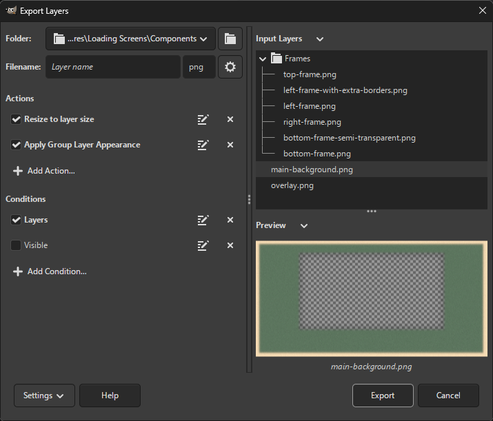
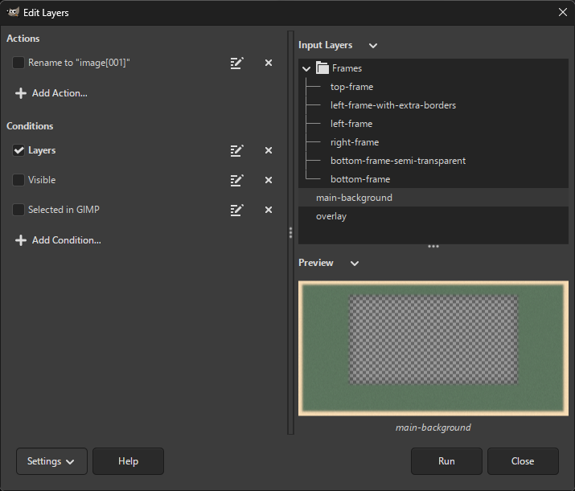

## Exporting Layers

Open your image in GIMP and select `File → Export Layers...`.
A dialog that appears allows you to choose the output folder and file extension.

To export layers, press the `Export` button.
A dialog corresponding to the file format appears, allowing you to adjust export settings.
Some file formats do not display dialogs, while some display the dialog for each layer (this cannot be prevented because such a file format only allows an interactive export).

### Changing File Extension

Type or choose your desired file extension in the `File extension` text entry.
The dropdown list displays available file formats alongside their associated file extensions.
If a file format contains multiple file extensions, the first is selected by default, but you may also choose from the other extensions (by clicking or pressing Tab).

For now, the dropdown only contains a fixed list of file formats provided by GIMP and some recognized third-party plug-ins.
However, you may still enter a file extension not in the list in case you use a file format plug-in not recognized by Batcher.

### Exporting Layers Instantly

You can export in a single click by running `File → Export Layers Now`.
This is useful e.g. if you made changes to your image and you want to export again with the same settings.

## Editing Layers

To switch to layer editing mode, open your image in GIMP and select `File → Export Layers...`, then press the `Settings` button and select `Edit Layers`.

The dialog now displays a list of procedures and constraints applied to layers:

It is highly recommended to uncheck `Use layer size` as the entire image would be resized to the last layer processed.

To learn more about procedures and constraints, see [Customization](Customization.md).

If the `Layers` constraint is unchecked, layer groups will also be processed. The layer groups will be copied and inserted as regular layers to work around the fact that some procedures cannot be applied on layer groups (e.g. `gimp-drawable-brightness-contrast`).

## Preview

To have a better grasp of what layers are actually exported and how, the preview displays the layer names in a folder structure.
If you select a layer, the layer contents will be displayed at the bottom of the preview.

You can adjust the width of the entire preview by dragging the separator between the preview and the folder chooser.
You can also adjust the height of the previewed image by dragging the separator above the image.

If the previewed image takes too long to render, the preview is no longer updated automatically.
A button next to the arrow button above the image is displayed that allows you to manually update the image.
To switch between automatic and manual update, click on the arrow button and select `Update Image Preview Automatically`.

Note that the preview is only an approximation of what the exported image will look like and thus is not completely accurate when exporting with certain file formats.
For example, the preview will show a transparent image if the JPEG format (which does not support transparency) is selected.

## Managing Settings

After a successful export or editing, your settings (output folder, file extension, dialog position and size, etc.) are automatically saved.
You can save settings manually anytime by selecting `Settings → Save Settings` or pressing Ctrl + S anywhere in the dialog.
To reset settings to their default values, select `Settings → Reset Settings`.

You may also export settings to a custom file by selecting `Settings → Export Settings...`.
This allows swapping between different plug-in configurations or sharing them.
To import settings from a file, select `Settings → Import Settings...` and select the file.

## More Customization

If you find yourself in the need of customizing layer names, applying additional procedures before exporting or excluding specific layers from the export, see [Customization](Customization.md).

## Running Batcher Without Dialog

It is also possible to run Batcher without an interactive dialog, e.g. for automation purposes.

The `plug-in-batch-export-layers` procedure exports layers with the specified or last used (or saved) settings, depending on the value of the `run-mode` parameter.

You can run `plug-in-batch-export-layers` with settings imported from a file (obtained via `Settings → Export Settings...` in the plug-in dialog) by specifying the `settings-file` parameter. In that case, the `run-mode` must be `Gimp.RunMode.NONINTERACTIVE` and all other procedure arguments will be ignored (since these arguments will be assigned values from the settings file).

The `plug-in-batch-export-layers-now` procedure exports layers instantly, always with the last used settings.

## Known Issues

Sometimes, after you press the Export button, it may seem as though nothing happens.
In that case, the file format dialog may be displayed behind GIMP. If so, simply select the dialog to bring it up.

The following file formats require displaying the file format dialog for each image to be exported, not just the first image:
* C source,
* HTML.

On Windows, exporting with the following file formats does not work properly if file paths contain accented (Unicode) characters:
* X PixMap Image.
